# 基于Flask的招聘数据可视化系统设计与实现

> 公开脱敏版：保留论文正文与技术插图；学校模板、页眉页脚、校徽、身份元数据不进入公开文件，含个人资料或凭据的截图已隐藏。

目 录

## 绪论

### 选题背景

在现代社会中，招聘市场一直是企业和求职者关注的焦点之一。随着经济的发展和科技的进步，招聘行业也日益呈现出多样化、复杂化的特点。在这样的背景下，设计并实现一个基于Flask的招聘数据可视化系统，成为了解招聘市场趋势、分析人才需求、调整招聘策略的重要工具。

随着互联网的普及，招聘信息发布已经从传统的招聘会、报纸广告转向了各类招聘网站和社交媒体平台。这些平台聚集了大量的招聘信息，包括各行各业的岗位需求、薪资待遇、工作地点等。通过收集并分析这些数据，可以更加全面地了解不同行业、不同地区的招聘情况，为企业和求职者提供更精准的信息支持。

招聘市场的竞争日益激烈，企业需要更加高效地吸引和挖掘人才。通过数据分析，可以发现人才的分布规律、流动趋势，帮助企业更好地制定招聘策略和人才培养计划。同时，求职者也可以通过招聘数据了解到不同行业、不同岗位的就业机会和发展前景，有针对性地提升自己的职业竞争力。

招聘数据的可视化分析不仅有助于企业和求职者更直观地理解招聘市场的状况，也为政府部门和相关研究机构提供了重要的参考和决策支持。通过对招聘数据的可视化呈现，可以发现就业结构的变化、人才流动的趋势，为宏观经济政策的制定和人力资源规划提供科学依据。

设计并实现一个基于Flask的招聘数据可视化系统，既能够满足企业和求职者对招聘信息的需求，又能够促进招聘市场的健康发展和人才流动，具有重要的现实意义和应用价值。

### 国内外发展现状

在国内外，招聘数据可视化技术正在迅速发展并得到广泛应用。在国外，许多招聘网站和人力资源公司已经开始采用数据可视化技术，通过图表、地图等形式直观展示招聘市场的数据情况。同时，一些研究机构和大学也开展了相关研究，探索数据可视化在人力资源管理中的应用。

在国内，随着互联网和人工智能技术的发展，越来越多的招聘平台和企业开始重视数据的分析和可视化。一些知名的招聘网站如智联招聘、前程无忧等也推出了数据可视化的服务，为企业和求职者提供更直观的招聘数据展示。同时，一些大型企业也建立了自己的招聘数据分析团队，通过数据可视化技术来分析招聘市场的趋势和人才供需情况，为企业招聘和人才培养提供数据支持。

在学术领域，国内外的研究机构和大学也积极开展招聘数据可视化技术的研究。他们通过数据挖掘、机器学习等技术来分析招聘市场的数据，并利用可视化技术将分析结果直观地展示出来，为决策者和研究人员提供数据参考和决策支持。

总的来说，国内外招聘数据可视化技术的发展已经取得了一定的成就，但仍面临一些挑战，如数据质量、算法精度、用户体验等。未来，随着技术的不断进步和应用场景的不断拓展，招聘数据可视化技术将会发挥更重要的作用，为招聘市场的健康发展和人才流动提供更多的支持。

### 目的与意义

招聘数据可视化系统的设计与实现旨在解决当前招聘市场面临的信息不对称、数据碎片化等问题，从而提升招聘效率、优化招聘流程，并为企业和求职者提供更智能、更精准的招聘服务。其意义主要体现在以下几个方面：

招聘数据可视化系统有助于实现信息的集中管理和统一展示。通过收集各类招聘网站、企业招聘信息等多来源的数据，将其整合并通过可视化手段展示出来，使企业和求职者能够更全面地了解招聘市场的动态和趋势，减少信息的不对称性，提高信息的透明度和可访问性。

招聘数据可视化系统可以帮助企业和求职者更快速地定位和匹配合适的人才或职位。通过对招聘数据的分析和可视化展示，可以发现人才的分布规律、行业热点、薪资水平等信息，为企业招聘和求职者求职提供更精准的指导和支持，提高招聘效率和成功率。

招聘数据可视化系统还有助于促进招聘市场的健康发展和人才流动。通过对招聘数据的分析，可以及时发现市场需求变化、人才供需矛盾等问题，为政府部门和相关机构制定人力资源政策提供科学依据，推动人才流动和经济发展。

招聘数据可视化系统的设计与实现还将促进招聘行业的数字化转型和智能化发展。通过运用先进的数据分析、人工智能等技术，实现对招聘数据的智能化处理和可视化展示，为招聘行业的创新和发展提供新的路径和工具。

## 关键技术介绍

### 关键性开发技术介绍

#### Python

Python 是一种高级、动态类型的编程语言，自从 1991 年首次发布以来，已经成为全球范围内广泛应用的编程语言之一。Python 的特点包括简洁、易读、可扩展性强，以及拥有庞大的开源社区。这些优势使得 Python 成为了开发网络安全检测系统的理想选择。

Python 语法简洁、易读，有助于提高开发效率，降低维护成本。这种简洁性使得 Python 代码更容易理解和修改，对于开发网络安全检测系统这样需要频繁更新和维护的项目而言，Python 的易用性大大提高了开发效率。

Python 拥有强大的标准库和丰富的第三方库，这些库为开发者提供了许多现成的功能和工具，可以大大减少开发工作量。在网络安全领域，Python 社区已经为开发者提供了大量的安全相关库，如 Requests、BeautifulSoup、Scrapy 等用于网络爬虫，Nmap、Scapy 等用于网络扫描，以及 Django、Flask 等 Web 框架。这些库简化了网络安全检测系统的开发过程，为开发者提供了丰富的资源。

#### Flask

Flask 是一个轻量级的 Python Web 框架，采用简单而灵活的设计理念。其核心特点包括使用 Jinja2 模板引擎进行 HTML 页面渲染，通过装饰器定义简洁清晰的路由，提供了内置的开发服务器方便测试，基于 Werkzeug WSGI 工具箱实现与 WSGI 兼容的服务器集成。Flask 还支持丰富的扩展机制，可以方便地集成数据库、表单处理、用户认证等功能。由于其简洁性和可定制性，Flask 成为开发小型到中型 Web 应用的理想选择，同时也是学习 Python Web 开发的良好入门框架。

#### SQLite

SQLite是一种轻量级的嵌入式关系型数据库管理系统，它的设计目标是在没有服务器的情况下实现自给自足的数据库引擎。SQLite的核心特点包括零配置、无服务器、跨平台、零配置、事务性、高性能和高可靠性。

首先，SQLite不需要单独的服务器进程或配置文件，因此非常适合嵌入到各种应用程序中。它的数据库以单个文件形式存储在主机文件系统中，可以轻松地在不同操作系统之间进行移植和部署，大大简化了数据库的管理和部署过程。

其次，SQLite支持SQL标准的所有核心功能，包括复杂的查询、事务、触发器和外键约束等，使其能够满足大部分应用程序的数据库需求。同时，SQLite具有优秀的性能和高度可靠性，能够处理大型数据集并保持快速响应。

另外，SQLite还具有易用性和灵活性，它的API简单易用，允许开发者使用流行的编程语言（如C、C++、Java、Python等）进行数据库操作。此外，SQLite支持各种数据类型，并提供了丰富的内置函数和扩展接口，使得开发者能够轻松地实现各种数据库功能和定制化需求。

#### matplotlib

Matplotlib是一个用于创建静态、动态和交互式可视化的Python库，它提供了一种类似于Matlab的绘图接口，能够轻松生成各种类型的图表和图形。Matplotlib的设计目标是使数据可视化变得简单、直观、灵活，并且能够满足不同需求的绘图需求。

Matplotlib支持的图形类型包括折线图、散点图、柱状图、饼图、等高线图、3D图等，以及自定义的复杂图表和图形。它提供了丰富的绘图功能和参数选项，允许用户对图形进行高度定制，包括颜色、线型、标签、注释等。

Matplotlib还能够与多种Python科学计算库（如NumPy、Pandas等）无缝集成，方便地将数据导入到图表中进行可视化分析。同时，Matplotlib也支持多种输出格式，包括图片文件（如PNG、JPEG、SVG等）和交互式图形界面（如Tkinter、Qt等），满足不同场景下的需求。

### 其它相关技术

#### HTTP请求

HTTP（Hypertext Transfer Protocol）是一种用于传输超文本数据的应用层协议，它是Web的基础之一。通过HTTP协议，客户端（通常是浏览器）可以向服务器发送请求，并从服务器接收响应，实现了客户端与服务器之间的通信和数据交换。

在图书管理系统中，HTTP请求技术扮演着至关重要的角色。首先，图书管理系统通常是基于Web的应用程序，客户端需要向服务器发送各种类型的请求。HTTP请求技术通过定义不同的请求方法（如GET、POST、PUT、DELETE等），实现了对不同操作的标准化和规范化，确保了请求的准确性和有效性。其次，HTTP请求技术支持在请求头中添加各种参数和信息，如请求头、请求体、Cookie等，可以传递用户身份认证信息、请求参数等，从而实现了用户身份的验证和数据的传递。此外，HTTP请求技术还支持跨域请求、文件上传、会话管理等功能，为图书管理系统的开发和运行提供了丰富的功能和灵活性。

## 系统分析

### 功能性需求分析

本系统是一款基于Flask的招聘数据可视化系统，因此系统需要具有一定的数据获取能力，可以获取网络上的招聘信息数据，然后系统需要一定的数据清洗能力，可以去除掉不需要的数据，然后就是数据分析能力，可以对清洗后的数据进行分析，最后就是可视化展示能力，通过Flask与Web将分析后的结果与爬取到的数据展示在Web界面上。

因此本系统共有四大板块：系统登录，数据总览，数据爬取，数据清洗，数据分析，其中系统登录包含了登录模块与注册模块，数据爬取包含了爬取，爬取结果预览，清洗，清洗结果预览，数据分析包含了分析与可视化展示，因此本系统的用例图如图3.1所示。

图3.1 用例图

数据爬取用例中，系统主要对51job网站的数据进行爬取，爬取此网站上的所有岗位数据，与岗位对应的要求，金额等数据，如表3.1所示。

表 3.1 数据爬取

<table>
<tr><td>名称</td><td colspan="2">数据爬取</td></tr>
<tr><td>概述</td><td colspan="2">爬取51job网站的数据</td></tr>
<tr><td>参与者</td><td colspan="2">系统</td></tr>
<tr><td>前置条件</td><td colspan="2">准备好51job的cookie</td></tr>
<tr><td>基本事件流</td><td>步骤</td><td>活动</td></tr>
<tr><td></td><td>1</td><td>启动系统</td></tr>
<tr><td></td><td>2</td><td>登录进入系统</td></tr>
<tr><td></td><td>3</td><td>输入关键字，选择地区，选择文件存储方式</td></tr>
<tr><td></td><td>4</td><td>开始爬取，如果存储方式为csv则将文件存储到csv中，如果是SQLite则生成SQLite的文本文件</td></tr>
</table>

爬取结果预览用例中，登入系统的用户可以进行爬取结果的查看，并可以进行结果导出与导入，如表3.2所示。

表 3.2 爬取结果预览

<table>
<tr><td>名称</td><td colspan="2">爬取结果预览</td></tr>
<tr><td>概述</td><td colspan="2">预览爬取到51job网站的数据</td></tr>
<tr><td>参与者</td><td colspan="2">登入系统的用户</td></tr>
<tr><td>前置条件</td><td colspan="2">已经爬取到相关数据</td></tr>
<tr><td>基本事件流</td><td>步骤</td><td>活动</td></tr>
<tr><td></td><td>1</td><td>启动系统</td></tr>
<tr><td></td><td>2</td><td>登录进入系统</td></tr>
<tr><td></td><td>3</td><td>进入爬取结果预览界面</td></tr>
<tr><td></td><td>4</td><td>选择界面下方的分页按钮，进行分页查看</td></tr>
<tr><td></td><td>5</td><td>点击导入按钮，选择导入的文件，即可为爬取结果增加新的数据</td></tr>
<tr><td></td><td>6</td><td>点击导出，即可导出当前的爬取结果</td></tr>
</table>

数据清洗用例中，主要对爬取的结果进行清洗，去掉爬取结果中不适用于分析的数据，比如有缺失值等，如表3.3所示。

表 3.3 数据清洗

<table>
<tr><td>名称</td><td colspan="2">数据清洗</td></tr>
<tr><td>概述</td><td colspan="2">清洗51job网站的数据</td></tr>
<tr><td>参与者</td><td colspan="2">登入系统的用户</td></tr>
<tr><td>前置条件</td><td colspan="2">已经爬取到相关数据</td></tr>
<tr><td>基本事件流</td><td>步骤</td><td>活动</td></tr>
<tr><td></td><td>1</td><td>启动系统</td></tr>
<tr><td></td><td>2</td><td>登录进入系统</td></tr>
<tr><td></td><td>3</td><td>进入数据清洗界面</td></tr>
<tr><td></td><td>4</td><td>系统自动进行数据清洗</td></tr>
<tr><td></td><td>5</td><td>展示清洗后的结果：总数据，被清洗的数据，清洗后的数据</td></tr>
</table>

系统登录用例，主要用以保护系统数据安全，防止他人盗用本系统的数据，用户需要输入账号与密码进行系统登录，登录成功系统会自动为该用户生成Session，如表3.4所示。

表 3.4 系统登录

<table>
<tr><td>名称</td><td colspan="2">系统登录</td></tr>
<tr><td>概述</td><td colspan="2">输入账号与密码，进行系统登录</td></tr>
<tr><td>参与者</td><td colspan="2">用户</td></tr>
<tr><td>前置条件</td><td colspan="2">数据库中已经存在该用户的账号与密码数据</td></tr>
<tr><td>基本事件流</td><td>步骤</td><td>活动</td></tr>
<tr><td></td><td>1</td><td>启动系统</td></tr>
<tr><td></td><td>2</td><td>进入系统登录界面</td></tr>
<tr><td></td><td>3</td><td>输入账号与密码进行系统登录</td></tr>
<tr><td></td><td>4</td><td>如果账号与密码输入错误，提示账号与密码错误</td></tr>
<tr><td></td><td>5</td><td>如果账号与密码输入正确，则提示登录成功，系统跳转首页</td></tr>
</table>

系统注册用例如表3.5所示，用户输入账号与密码进行系统注册，系统需要对用户输入的账号进行重复性判断，防止本系统数据错误。

表 3.5 系统注册

<table>
<tr><td>名称</td><td colspan="2">系统注册</td></tr>
<tr><td>概述</td><td colspan="2">输入账号与密码，进行系统注册</td></tr>
<tr><td>参与者</td><td colspan="2">用户</td></tr>
<tr><td>前置条件</td><td colspan="2">无</td></tr>
<tr><td>基本事件流</td><td>步骤</td><td>活动</td></tr>
<tr><td></td><td>1</td><td>启动系统</td></tr>
<tr><td></td><td>2</td><td>进入系统注册界面</td></tr>
<tr><td></td><td>3</td><td>输入账号与密码进行系统注册</td></tr>
<tr><td></td><td>4</td><td>如果账号重复，提示账号重复</td></tr>
<tr><td></td><td>5</td><td>如果账号未重复，则注册成功，跳转登录界面</td></tr>
</table>

数据分析用例如表3.6所示，系统将对清洗后的数据进行分析，主要进行工作年限分析，学历要求分析，学历与薪酬关系分析，薪酬分析，公司规模分析等，来展示现阶段求职环境。

表 3.6 数据分析

<table>
<tr><td>名称</td><td colspan="2">数据分析</td></tr>
<tr><td>概述</td><td colspan="2">进入系统，点击数据分析，查看分析后的可视化结果</td></tr>
<tr><td>参与者</td><td colspan="2">用户</td></tr>
<tr><td>前置条件</td><td colspan="2">登入系统</td></tr>
<tr><td>基本事件流</td><td>步骤</td><td>活动</td></tr>
<tr><td></td><td>1</td><td>启动系统</td></tr>
<tr><td></td><td>2</td><td>登入系统，进入数据分析界面</td></tr>
<tr><td></td><td>3</td><td>系统自动开始分析</td></tr>
<tr><td></td><td>4</td><td>生成薪酬分析，工作年限分析，学历要求分析等结果</td></tr>
<tr><td></td><td>5</td><td>界面渲染该结果</td></tr>
</table>

数据总览用例描述如表3.7所示，主要展示本系统中所有数据的预处理分析结果，展示数据总量，地区数量，公司数量，公司类型数量，汇总后的月招聘岗位数据，星期招聘岗位数据。

表 3.7 数据总览

<table>
<tr><td>名称</td><td colspan="2">数据总览</td></tr>
<tr><td>概述</td><td colspan="2">进入系统，进入首页，查看预处理的数据总览</td></tr>
<tr><td>参与者</td><td colspan="2">用户</td></tr>
<tr><td>前置条件</td><td colspan="2">登入系统</td></tr>
<tr><td>基本事件流</td><td>步骤</td><td>活动</td></tr>
<tr><td></td><td>1</td><td>启动系统</td></tr>
<tr><td></td><td>2</td><td>登入系统，进入首页</td></tr>
<tr><td></td><td>3</td><td>查看数据总量，地区数量等汇总数据</td></tr>
<tr><td></td><td>4</td><td>查看月招聘数，星期岗位招聘数据的折线图</td></tr>
</table>

### 非功能性需求分析

性能要求：系统应该能够处理大量的数据并且在用户请求时快速响应，保持良好的性能表现。页面加载速度应该在可接受范围内，不应该让用户感到等待过长。

可伸缩性：系统应该具有良好的可伸缩性，能够处理不断增长的用户量和数据量。它应该能够轻松地扩展以满足未来的需求，而不需要进行大规模的重构。

安全性：系统应该具有一定的安全性措施，确保用户数据的保密性和完整性。采取适当的授权和认证机制，以确保只有授权用户才能够访问系统中的敏感信息。

可靠性：系统应该具有高可靠性，能够保持稳定运行并且尽量避免出现故障。在出现故障时，系统应该能够快速恢复，并且不会丢失用户数据或造成不可挽回的损失。

易用性：系统应该具有良好的用户体验，界面设计应该简洁直观，操作流程应该清晰易懂。用户应该能够轻松地找到需要的功能，并且能够快速上手使用系统。

容错性：系统应该具备一定的容错性，能够处理用户可能出现的误操作或异常情况，并且给予用户合适的提示或错误信息，以便用户能够及时纠正或处理问题。

数据完整性：系统应该确保数据的完整性，避免因为系统错误或者其他原因导致数据丢失或损坏。在数据输入、处理和存储过程中，应该采取适当的措施来验证数据的有效性和正确性。

### 可行性分析

技术可行性：Flask是一个轻量级的Python Web框架，具有灵活性和简单易用的特点。由于Python语言的流行和Flask框架的广泛应用，技术上实现这样一个系统是可行的。同时，Python拥有丰富的数据处理和可视化库（如Pandas、Matplotlib、Plotly等），可以很方便地实现数据处理和可视化需求。

市场需求可行性：招聘数据分析在人力资源管理和企业决策中具有重要作用。随着企业对数据驱动决策的需求增加，招聘数据可视化分析系统具有广阔的市场需求。通过提供直观、可视化的招聘数据分析报告，能够帮助企业更好地了解人才市场趋势、优化招聘策略，提高招聘效率和质量。

经济可行性：开发一个基于Flask的招聘数据可视化分析系统相比于传统的软件开发成本相对较低。由于Flask是一个免费开源的框架，开发人员可以使用现有的工具和资源来快速构建系统，从而降低开发成本。同时，通过提供订阅或许可证模式的服务，可以实现长期的经济收益。

风险分析：虽然技术上实现该系统是可行的，但也存在一定的风险。例如，开发过程中可能会遇到技术难题或者对数据安全和隐私保护的法律法规要求。另外，市场竞争激烈，需要与其他类似系统进行差异化竞争，以吸引用户和客户。

基于Flask的招聘数据可视化分析系统在技术、市场和经济方面都具有可行性。然而，需要在开发过程中充分考虑风险，并及时调整策略以确保项目的顺利实施和长期运营。

## 系统设计

### 架构设计

通过上述的需求分析得知，本系统分为四大类：数据爬取，数据总览，登录注册，数据分析，系统功能结构图如图4.1所示。

图4.1 系统功能结构图

系统采用的架构为B/S架构，服务端由Flask提供，系统前端为HTML/CSS/JavaScript组成，前端与服务端的数据交互采用了HTTP请求的方式，然后服务端提供了登录，注册，数据爬取，爬取结果预览，数据分析等功能，并且继承了pandas，BeautifulSoup，selenium，Matplotlib等依赖来实现这些功能，系统数据将存储在CSV与SQLite中，系统的架构图如图4.2所示。

图4.2 系统架构图

### 功能设计

#### 登录

用户提交登录请求后，客户端向服务器发送登录请求。服务器首先检查用户提交的参数是否完整，如果不完整，则返回400错误，提示参数不能为空；客户端显示参数不能为空的提示给用户。如果参数完整，则服务器尝试连接数据库，如果数据库连接成功，则查询用户信息；如果数据库连接失败，则返回500错误，提示数据库连接失败；客户端显示数据库连接失败的提示给用户。如果数据库查询成功，则判断用户是否存在且密码匹配，如果是，则返回登录成功消息；否则返回400错误，提示用户名或密码错误；客户端显示用户名或密码错误的提示给用户，时序图如图4.3所示。

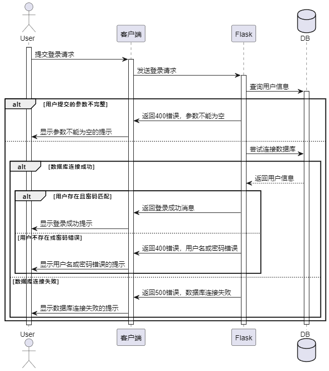

图4.3 登录时序图

#### 注册

用户提交注册请求后，客户端向服务器发送注册请求。服务器尝试连接数据库并查询用户信息。如果用户提交的参数不完整，则服务器返回400错误，提示参数不能为空；客户端显示参数不能为空的提示给用户。如果数据库连接成功，则查询用户信息，如果用户已存在，则返回用户名已存在的提示；如果用户不存在，则添加新用户信息，返回注册结果，客户端显示注册成功的提示给用户。如果数据库连接失败，则返回500错误，提示数据库连接失败；客户端显示数据库连接失败的提示给用户，注册时序图如图4.4所示。

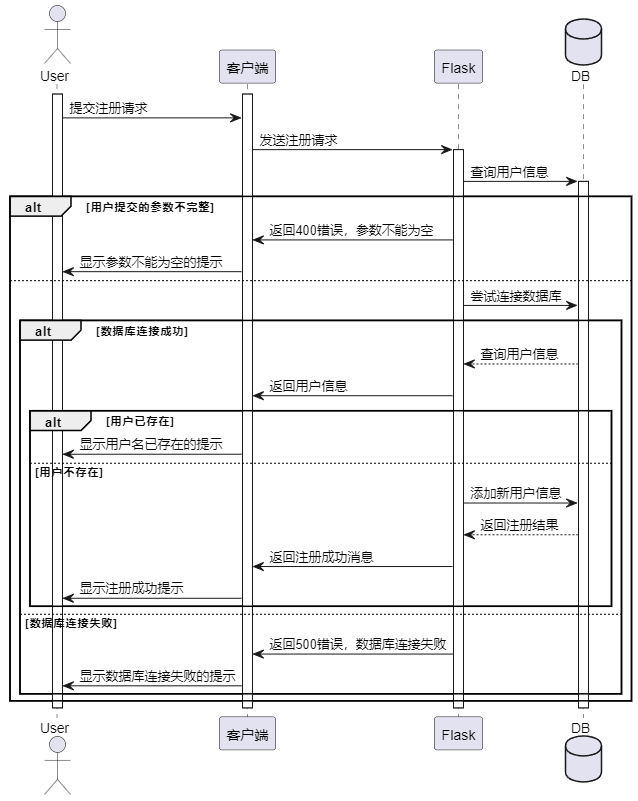

图4.4 注册时序图

#### 数据爬取

用户提交爬虫任务请求后，客户端向服务器发送请求。服务器触发爬虫任务，并根据参数判断是需要全量爬取还是增量爬取。如果参数不完整，则返回400错误，提示参数不能为空；客户端显示参数不能为空的提示给用户。如果参数完整，则调用相应的爬虫函数。最后，服务器返回成功消息给客户端，客户端显示成功提示给用户，时序图如图4.5所示。

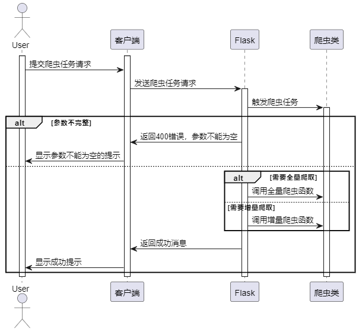

图4.5 数据爬取时序图

爬取函数实现时序图如图4.6所示，服务器调用爬虫的start函数，爬虫开始执行爬取任务。爬虫首先初始化爬虫参数，然后构建WebDriver，并执行滑块验证。接着，爬虫获取HTML源码，使用BeautifulSoup，解析HTML并提取数据。最后，爬虫将数据存储到指定的存储引擎中，并关闭WebDriver。任务完成后，服务器向客户端返回爬虫任务完成消息。

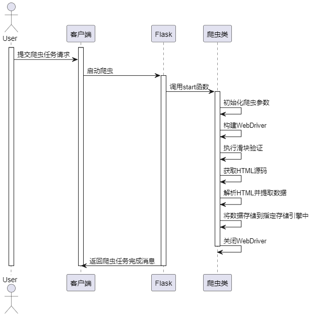

图4.6 数据爬取实现时序图

#### 数据清洗

用户发起数据清洗请求后，客户端向服务器发送请求。服务器调用数据清洗函数，检查参数合法性。如果参数异常或数据源不支持，则返回400错误，提示参数异常；客户端显示参数异常提示。如果参数合法，则获取原始数据，如果原始数据为空，则返回500错误，提示无可用数据；客户端显示无可用数据提示。如果有原始数据，则获取已清洗数据，并计算数据数量。最后，服务器返回数据统计结果给客户端；客户端显示数据统计结果，时序图如图4.6所示。

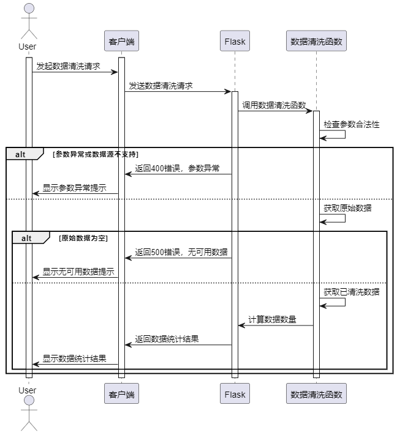

图4.7 数据清洗时序图

#### 数据预览

用户请求获取职位数据后，客户端向服务器发送请求。服务器调用数据获取函数，检查参数合法性。如果参数异常，则返回400错误，提示参数异常；客户端显示参数异常提示。如果参数合法，则从清洗后的数据中获取职位数据。如果数据为空，则返回空数据；客户端显示无数据提示。如果有数据，则根据分页信息筛选数据，并返回获取到的职位数据；客户端显示职位数据列表，时序图如图4.8所示。

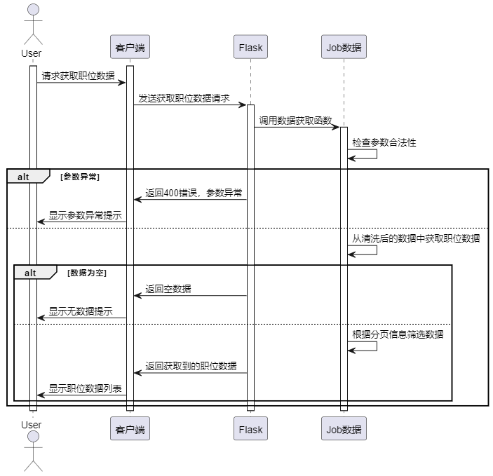

图4.8 数据预览时序图

#### 数据分析

数据分析时序图如图4.9所示，用户请求获取职位分析图表数据后，客户端向服务器发送请求。服务器调用Matplotlib绘制函数来生成图表，Matplotlib返回绘制结果给服务器，服务器再返回职位分析图表数据给客户端，最后客户端显示职位分析图表。

Matplotlib在接收到服务器传递的数据后，首先根据数据绘制相应的图表。它会根据数据的类型和要求绘制不同类型的图表，如柱状图、饼状图、散点图等。在绘制过程中，Matplotlib会处理数据的格式化、图表的布局和样式等细节。

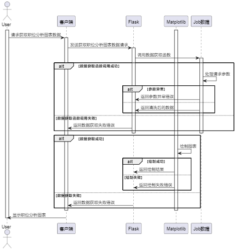

图4.9 数据分析时序图

#### 数据总览

首先，用户通过客户端发起请求。客户端将请求发送给Flask服务器。服务器接收到请求后，调用后端Job数据处理模块来获取数据。如果请求参数不完整，服务器将返回400错误，并提示参数不能为空。如果请求参数完整，服务器将获取数据并返回给客户端，客户端收到数据后进行相应的处理和展示，时序图如图4.10所示。

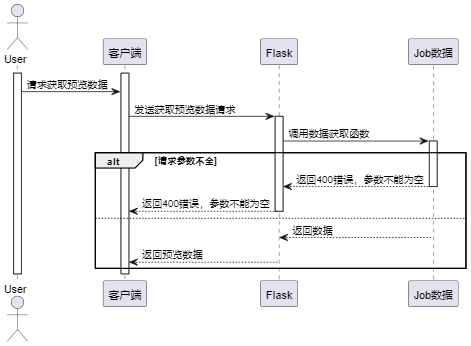

图4.10 数据总览时序图

### 数据库设计

本系统采用SQLite作为数据库，但根据功能设计，大部分数据存储在CSV文件中。因此，系统没有特定的数据实体设计。以下将根据51Job数据结构进行数据结构描述。

用户数据结构如表4.1所示，用户表主要字段为username与password，该字段存储着用户的登录账号与密码，方便系统服务端对用户输入的数据进行判断，来验证该用户是否为系统用户。

表4.1 用户表

<table>
<tr><td>字段名</td><td>数据类型</td><td>主键/允许空</td><td>字段含义</td></tr>
<tr><td>id</td><td>int</td><td>PRIMARY KEY</td><td>用户表主键</td></tr>
<tr><td>username</td><td>varchar</td><td>不允许</td><td>登录账号</td></tr>
<tr><td>password</td><td>varchar</td><td>不允许</td><td>登录密码</td></tr>
</table>

51Job表结构如表4.2所示，该表包含了51Job网站上的招聘信息，主要字段包括工作昵称（jobName）、标签（tags）、地区（area）、工资（salary）、工作年限（workYear）、学历（degree）、公司名称（companyName）、公司类型（companyType）、公司大小（companySize）、公司logo（logo）以及时间（time）。这些字段描述了招聘岗位的各种属性，从工作要求到公司信息都有涵盖，为用户提供了全面的招聘信息。

表4.2 51Job表

<table>
<tr><td>字段名</td><td>数据类型</td><td>主键/允许空</td><td>字段含义</td></tr>
<tr><td>jobName</td><td>varchar</td><td>允许</td><td>工作昵称</td></tr>
<tr><td>tags</td><td>varchar</td><td>允许</td><td>标签</td></tr>
<tr><td>area</td><td>varchar</td><td>允许</td><td>地区</td></tr>
<tr><td>salary</td><td>varchar</td><td>允许</td><td>工资</td></tr>
<tr><td>workYear</td><td>varchar</td><td>允许</td><td>工作年限</td></tr>
<tr><td>degree</td><td>varchar</td><td>允许</td><td>学历</td></tr>
<tr><td>companyName</td><td>varchar</td><td>允许</td><td>公司名称</td></tr>
<tr><td>companyType</td><td>varchar</td><td>允许</td><td>公司类型</td></tr>
<tr><td>companySize</td><td>varchar</td><td>允许</td><td>公司大小</td></tr>
<tr><td>logo</td><td>varchar</td><td>允许</td><td>公司logo</td></tr>
<tr><td>logo</td><td>varchar</td><td>允许</td><td>时间</td></tr>
</table>

## 系统实现

### 登录实现

登录界面如图5.1所示，该登录页面通过HTML和JavaScript实现了用户登录功能。用户在表单中输入用户名和密码，点击登录按钮后，JavaScript脚本会获取用户输入的信息，并通过Fetch API向后端发送POST请求。后端收到请求后验证用户名和密码，如果验证成功，返回包含成功信息的JSON响应，前端根据响应结果显示相应提示，并将用户信息保存到本地存储中。如果验证失败，则显示相应的错误提示。同时，还包含了记住密码功能，用户勾选记住密码后，会将用户名和密码保存到本地存储中，以便下次自动填充，主要代码如下所示。

<table>
<tr><td>db = None user = None connect = None response = Result() data = request.get_json() if not all(data.get(key) for key in [&#x27;username&#x27;, &#x27;password&#x27;]): abort(400, description=&#x27;参数不能为空！&#x27;) try: db = Database() connect = db.connect() user = connect.query(User).filter(User.username == data[&#x27;username&#x27;]).first() except Exception as e: connect.rollback() abort(500, description=str(e)) finally: connect.close() db.close() if not user or user.password != data.get(&#x27;password&#x27;): abort(400, description=&#x27;用户名或密码错误！&#x27;) session.update({&#x27;user&#x27;: user.username}) response.set_message(&#x27;登录成功&#x27;) response.set_status(1) response.set_code(200) return response.to_json()</td></tr>
</table>

代码5.1 登录

图5.1 系统登录界面

### 注册实现

系统注册界面如图5.2所示，页面使用HTML和JavaScript实现了用户注册功能。用户在表单中输入用户名、密码和确认密码，并勾选同意协议选项后，点击注册按钮。JavaScript脚本会获取用户输入的信息，进行必要的验证，包括检查用户名、密码和确认密码是否为空，以及确认密码是否与密码一致。如果验证通过，前端通过Fetch API向后端发送POST请求，后端收到请求后将用户信息存储，并返回相应的JSON响应。前端根据响应结果显示相应提示，注册成功后跳转到登录页面。如果验证或注册过程中出现错误，则显示相应的错误提示。

服务端使用Flask的@auth.route('/api/register', methods=["POST"])定义了注册接口。接收前端传来的JSON数据，验证用户名和密码是否为空，如果用户名已存在则返回错误信息，否则将用户信息存入数据库并返回注册成功信息，主要代码如下所示。

<table>
<tr><td>if user: abort(400, description=&#x27;用户名已存在！&#x27;) try: db = Database() connect = db.connect() user = User(**data) connect.add(user) connect.commit() except Exception as e: connect.rollback() abort(500, description=str(e)) finally: connect.close() db.close()</td></tr>
</table>

代码5.2 注册

图5.2 系统注册界面

### 数据总览

数据总览界面如图5.4所示，界面通过使用 Chart.js、SweetAlert 等插件实现了数据图表展示和交互式提示。页面通过 AJAX 请求获取后端提供的数据，并将数据动态加载到图表中进行展示。用户可以通过界面上的下拉选择框选择不同的数据源和数据类型，系统会根据用户选择的数据源和类型加载相应的数据。此外，页面还包括了用户注销功能，用户可以通过点击注销按钮实现用户登出操作。

服务端通过路由函数实现了获取招聘数据预览的功能。根据用户提供的数据源名称和类型，检查数据文件是否存在，并进行相应的数据处理。利用 Pandas 库对数据进行聚合和统计，计算月度和星期的招聘数据量，并将结果返回给前端页面，代码如下所示。

<table>
<tr><td>if not flag[dtype]: abort(500, &#x27;没有数据可以操作！&#x27;) data = get_data_by_name(name, dtype, directory) data[&#x27;issueDate&#x27;] = pd.to_datetime(data[&#x27;issueDate&#x27;]) monthlyCounts = data.groupby(data[&#x27;issueDate&#x27;].dt.to_period(&#x27;M&#x27;)).size() monthlyCounts = monthlyCounts.reset_index() monthlyCounts.columns = [&#x27;Month&#x27;, &#x27;Count&#x27;] monthlyCounts[&#x27;Month&#x27;] = monthlyCounts[&#x27;Month&#x27;].dt.strftime(&#x27;%m&#x27;).astype(int) weeklyCounts = data.groupby(data[&#x27;issueDate&#x27;].dt.dayofweek).size() weeklyCounts = weeklyCounts.reset_index() weeklyCounts.columns = [&#x27;Week&#x27;, &#x27;Count&#x27;] months = pd.Series(range(1, 13), name=&#x27;Month&#x27;)</td></tr>
</table>

代码5.3 数据总览

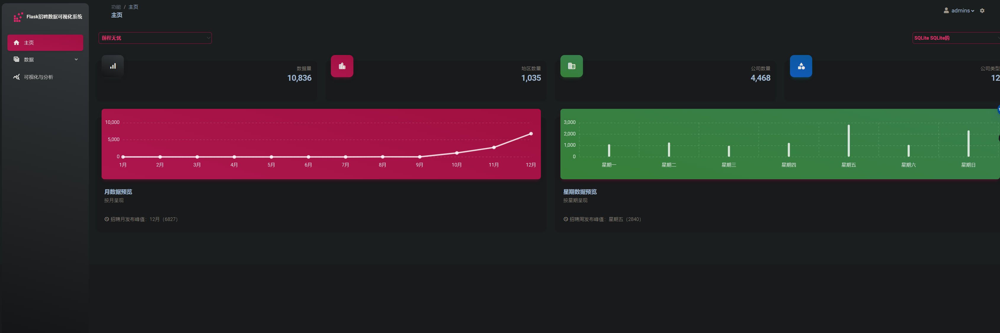

图5.3 数据总览界面

### 数据爬取预览

数据爬取预览界面如图5.4所示，页面顶部包含了导航栏和侧边栏，用于导航和展示系统的各个功能模块；页面中部包含了数据爬取的相关操作按钮和交互组件，如开始爬取、导入数据和导出数据等；页面底部则展示了一个表格，用于展示爬取到的招聘数据，并实现了数据的排序和展示功能。

服务端通过Flask的@spider.route('/api/jobs/row')接受来自前端的数据请求，在服务端中接收参数包括岗位名称、页码、每页数量、关键词和数据类型。根据参数筛选数据，支持分页和关键词搜索，最终返回符合条件的招聘岗位数据列表及相关信息的JSON格式数据，代码如下所示。

<table>
<tr><td>def get_data_by_name(name: str, dtype: str, directory: str): &quot;&quot;&quot; Get job data by job name :Arg: - name: job name - dtype: data source name - directory: data directory &quot;&quot;&quot; data = None if not os.path.exists(f&#x27;{directory}/{name}.{dtype}&#x27;): return pd.DataFrame([]) if dtype == &#x27;csv&#x27;: data = pd.read_csv(f&#x27;{directory}/{name}.csv&#x27;) if dtype == &#x27;db&#x27;: table = { &#x27;51job&#x27;: &#x27;job51&#x27; } sql = f&#x27;SELECT * FROM {table[name]} ;&#x27; data = pd.read_sql(sql, f&#x27;sqlite:///{directory}/{name}.db&#x27;) return data</td></tr>
</table>

代码5.4 数据爬取预览

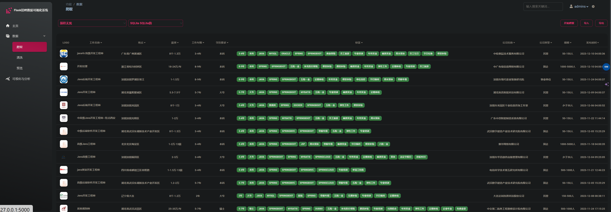

图5.4 数据爬取预览界面

### 数据爬取

数据爬取弹窗界面如图5.5所示，用户点击爬取，触发前端函数startModal，然后弹出弹窗，用户输入爬取的一些条件后，点击确认，前端请求接口：/api/spider/worker，在接口中主要执行以下逻辑实现爬取：

初始化参数和路径：根据传入的关键词、页码、每页数量和区域等参数，初始化爬虫实例，并设置输出文件的路径。

构建webdriver：通过Selenium库构建WebDriver，模拟浏览器操作，设置浏览器的参数以防止被检测为爬虫，并执行JavaScript代码以隐藏浏览器特征。

执行滑块验证：模拟人工操作执行滑块验证，防止被网站识别为机器人。

访问网页并获取HTML源码：使用构建好的WebDriver访问目标网页，获取页面的HTML源码。

解析HTML并提取数据：使用BeautifulSoup库解析HTML，提取出目标数据。

存储数据：根据指定的存储引擎（csv、db或both），将数据保存到相应的文件或数据库中。

这些主要逻辑都在JobSipder51类中实现，其中__driver_builder()函数用于构建WebDriver，__slider_verify()函数执行滑块验证，get_data_json()函数执行网页访问和数据解析，save()函数用于数据存储，代码如下所示。

<table>
<tr><td>:dict, save_engine: str): &quot;&quot;&quot; spider starter :Args: - param: Url param, type Dict{&#x27;keyword&#x27;: str, &#x27;pages&#x27;: int, &#x27;pageSize&#x27;: int, &#x27;area&#x27;: str} - save_engine: Data storage engine, support for csv, db and both &quot;&quot;&quot; if save_engine not in [&#x27;csv&#x27;, &#x27;db&#x27;, &#x27;both&#x27;]: return logger.error(&quot;The data storage engine must be &#x27;csv&#x27; , &#x27;db&#x27; or &#x27;both&#x27; &quot;) spider = JobSipder51(keyword=args[&#x27;keyword&#x27;], page=args[&#x27;pages&#x27;], pageSize=args[&#x27;pageSize&#x27;], area=args[&#x27;area&#x27;]) data_json = spider.get_data_json() spider.save(data_json, save_engine) logger.close()</td></tr>
</table>

代码5.5 数据爬取

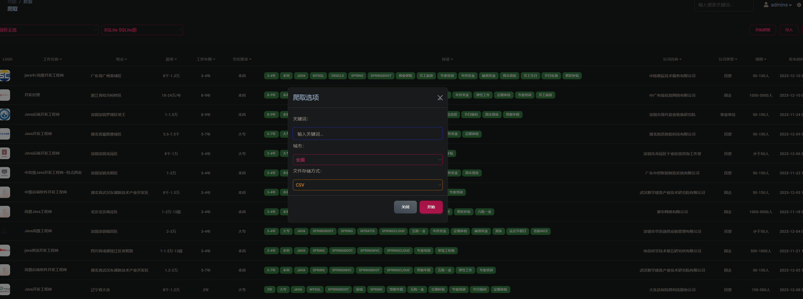

图5.5 数据爬取

### 数据清洗

数据清洗界面如图5.6所示，该HTML页面是一个Flask招聘数据可视化系统的前端界面，主要用于展示数据清洗功能。页面包含了导航栏、数据清洗区域、数据统计信息等部分。位于页面顶部，包括了系统名称和一些功能链接，如主页、数据、可视化与分析等。数据清洗区域：位于页面主体部分，包括了选择数据源（CSV或SQLite）、展示清洗预览的卡片和清洗按钮。用户可以选择数据源，查看数据的原始数量、当前数量和清洗数量，以及进行数据清洗操作。数据统计信息：展示了数据的原始数量、当前数量和清洗数量，用户可以通过选择数据源和点击清洗按钮来进行数据清洗操作。页面中嵌入了大量JavaScript脚本，用于处理用户交互、数据获取和展示，包括了对数据的异步获取、统计信息的更新、数据清洗操作的执行等功能。通过这些界面和脚本，用户可以方便地进行数据清洗操作，并实时查看数据的清洗情况和统计信息。

服务端的清洗实现步骤如下所示：数据清洗规则定义，数据处理方法，数据存储以及清洗流程控制。通过定义清洗规则和处理方法，对招聘数据的各个字段进行处理，包括薪资、工作年限、公司规模、学历、标签等。最后根据用户选择的存储引擎，将清洗后的数据保存到相应的文件或数据库中，代码如下所示。

<table>
<tr><td>name = request.args.get(&#x27;name&#x27;) dtype = request.args.get(&#x27;type&#x27;) if not dtype or name not in [&#x27;51job&#x27;]: abort(400, description=&#x27;参数异常！&#x27;) originDir = f&#x27;{os.path.abspath(&quot;..&quot;)}/output/job&#x27; origin_data = get_data_by_name(name, dtype, originDir) if origin_data.empty: abort(500, &#x27;无可用数据，请先进行爬取&#x27;) cleanDir = f&#x27;{os.path.abspath(&quot;..&quot;)}/output/clean&#x27; clean_data = get_data_by_name(name, dtype, cleanDir) data = { &#x27;originCount&#x27;: len(origin_data), &#x27;currentCount&#x27;: len(clean_data), &#x27;cleanCount&#x27;: len(origin_data) - len(clean_data) } if clean_data.empty: data[&#x27;cleanCount&#x27;] = 0 response = Result() response.set_status(1) response.set_message(&#x27;成功&#x27;) response.set_code(200) response.set_data(data) return response.to_json()</td></tr>
</table>

代码5.6 数据清洗

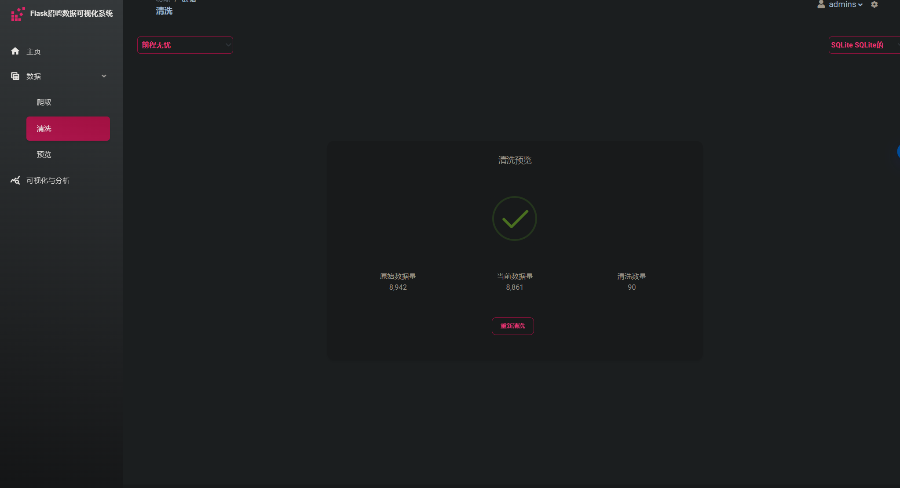

图5.6 数据清洗

### 数据分析

工作年限柱状图实现如图5.7所示，工作年限柱状图主要对51Job上的数据进行工年限分析，通过分析所有工作要求的年限数据，并进行汇总分析，可以得知市场中，主要需求的工作经验为3-4年，实现代码如下所示，统计了数据中工作年限的数量分布，并按照工作年限的大小进行排序。然后，通过绘制柱状图展示了工作年限与招聘数量之间的关系。图表的标题为“工作年限柱状图”，横轴标签为“工作年限”，纵轴标签为“招聘数量”，图例标签为“招聘数量”。在柱状图下方有一条注释，提示当工作经验为某个特定数值时，招聘岗位数量最多，表示该工作经验具有较大优势

<table>
<tr><td>workYearCount = data[&#x27;workYear&#x27;].value_counts() workYearCount = dict(sorted(workYearCount.items(), key=lambda x: int(re.findall(r&#x27;\d+&#x27;, x[0])[0]))) &#x27;bar&#x27;: {  &#x27;title&#x27;: &#x27;工作年限柱状图&#x27;,  &#x27;data&#x27;: workYearCount,  &#x27;xlabel&#x27;: &#x27;工作年限&#x27;,  &#x27;ylabel&#x27;: &#x27;招聘数量&#x27;,  &#x27;legendlabels&#x27;: [&#x27;招聘数量&#x27;],  &#x27;issue&#x27;: f&#x27;工作经验为 &lt;b&gt;{max(workYearCount, key=workYearCount.get)}&lt;/b&gt; 时，招聘岗位数量最多，优势越大&#x27; } chart = items[&#x27;bar&#x27;] chartdata = chart[&#x27;data&#x27;] keys = list(chartdata.keys()) values = list(chartdata.values()) plt = drawer.bar(keys, values, chart[&#x27;title&#x27;], chart[&#x27;xlabel&#x27;], chart[&#x27;ylabel&#x27;], chart[&#x27;legendlabels&#x27;]) items[&#x27;bar&#x27;][&#x27;data&#x27;] = drawer.generate_base64(plt)</td></tr>
</table>

代码5.7 工作年限

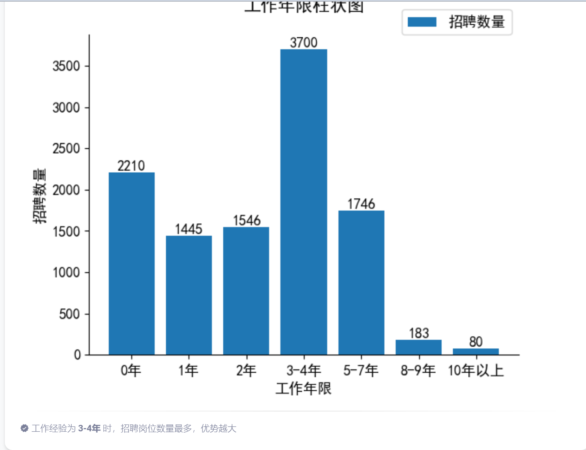

图5.7 工作年限柱状图

通过分析爬取的数据的学历要求，来得知市场学历占比情况，得知本科还是市场环境的主力军，如图5.8所示，代码实现如下所示，准备了用于绘制饼状图的数据，然后从数据中提取了键和值。接着使用绘图工具绘制了学历要求的饼状图，图表标题为“学历要求饼状图”。饼状图展示了不同学历要求下的招聘岗位数量占比情况。最后，代码更新了饼状图的数据，并将绘制的图表转换为 Base64 编码以便于在页面中显示。

<table>
<tr><td>&#x27;pie&#x27;: {  &#x27;title&#x27;: &#x27;学历要求饼状图&#x27;,  &#x27;data&#x27;: degreeCount,  &#x27;issue&#x27;: f&#x27;学历为 &lt;b&gt;{max(degreeCount, key=degreeCount.get)}&lt;/b&gt; 时，招聘岗位数量最多，优势越大&#x27; }, salaryByDegree = salaryByDegree[&#x27;min_salary&#x27;].apply(list).values degree = list(salaryByDegree.groups.keys()) chart = items[&#x27;pie&#x27;] chartdata = chart[&#x27;data&#x27;] keys = list(chartdata.keys()) values = list(chartdata.values()) plt = drawer.pie(values, keys, chart[&#x27;title&#x27;], keys) items[&#x27;pie&#x27;][&#x27;data&#x27;] = drawer.generate_base64(plt)</td></tr>
</table>

代码5.8 学历要求

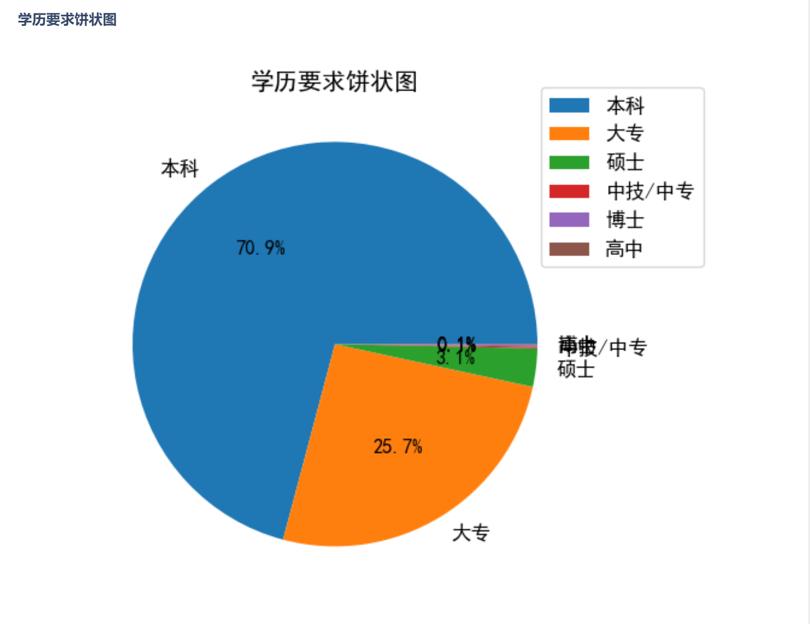

图5.8 学历要求分布图

通过分析薪酬与学历间的关系，可以得知大部分高薪工作分布在本科，大专，硕士学历中，如图5.19所示，代码如下所示，首先提取了箱线图的数据，包括学历要求和相应的薪资水平。然后使用绘图工具绘制了箱线图，横轴标签为“学历要求”，纵轴标签为“薪资水平”，图表标题为“薪资与学历箱线图”。箱线图展示了不同学历要求下的薪资分布情况。最后，代码将绘制的图表转换为 Base64 编码以便于在页面中显示。

<table>
<tr><td>chart = items[&#x27;boxplot&#x27;] chartdata = chart[&#x27;data&#x27;] plt = drawer.boxplot(chartdata[&#x27;degree&#x27;], chartdata[&#x27;salary&#x27;], chart[&#x27;title&#x27;], chart[&#x27;xlabel&#x27;], chart[&#x27;ylabel&#x27;]) items[&#x27;boxplot&#x27;][&#x27;data&#x27;] = drawer.generate_base64(plt) &#x27;boxplot&#x27;: { &#x27;title&#x27;: &#x27;薪资与学历箱线图&#x27;, &#x27;data&#x27;: { &#x27;salary&#x27;: salaryByDegree, &#x27;degree&#x27;: degree }, &#x27;xlabel&#x27;: &#x27;学历要求&#x27;, &#x27;ylabel&#x27;: &#x27;薪资水平&#x27;, &#x27;issue&#x27;: f&#x27;根据上述图标，可以知道招聘薪资分布主要集中在 &lt;b&gt;{topThreeDegree}&lt;/b&gt; 学历&#x27; }, topThreeTuple = sorted(salaryByDegree.groups.items(), key=lambda x: sum(x[1]), reverse=True)[:3] topThreeDegree = [str(degree[0]) for degree in topThreeTuple] topThreeDegree = &#x27;、&#x27;.join(topThreeDegree) salaryByDegree = salaryByDegree[&#x27;min_salary&#x27;].apply(list).values</td></tr>
</table>

代码5.9 薪资学历箱线图

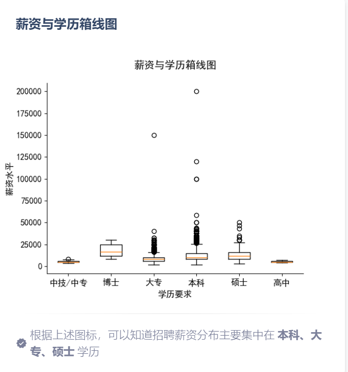

图5.9 薪资与学历箱线图

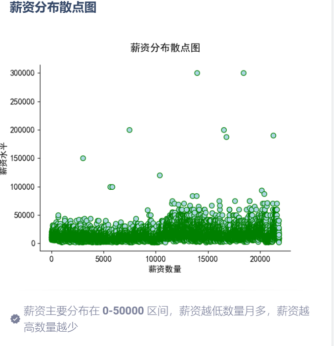

图5.10 薪资分布散点图

分析爬取数据的薪资，与薪资对应的数量关系可以得知大部分薪酬主要分布见0-5万区间，如图5.10所示，并且薪酬越低数量越多，薪酬越高数量越少，说明市场整体处于中等偏下水平，突出我国人才供应需求偏低，实现代码如下所示，首先，代码提取了数据中的薪资信息，计算了薪资的平均值和薪资水平。然后，根据薪资的最大值计算了薪资水平的区间，并在注释中描述了薪资主要分布在0到薪资水平区间的情况，且随着薪资水平增加，薪资数量逐渐减少。最后，绘制了散点图，并将其转换为 Base64 编码以便在页面中显示。

<table>
<tr><td>chart = items[&#x27;boxplot&#x27;]  chartdata = chart[&#x27;data&#x27;]  plt = drawer.boxplot(chartdata[&#x27;degree&#x27;], chartdata[&#x27;salary&#x27;], chart[&#x27;title&#x27;], chart[&#x27;xlabel&#x27;], chart[&#x27;ylabel&#x27;]) items[&#x27;boxplot&#x27;][&#x27;data&#x27;] = drawer.generate_base64(plt) &#x27;boxplot&#x27;: {  &#x27;title&#x27;: &#x27;薪资与学历箱线图&#x27;,  &#x27;data&#x27;: {  &#x27;salary&#x27;: salaryByDegree,  &#x27;degree&#x27;: degree  },  &#x27;xlabel&#x27;: &#x27;学历要求&#x27;,  &#x27;ylabel&#x27;: &#x27;薪资水平&#x27;,  &#x27;issue&#x27;: f&#x27;根据上述图标，可以知道招聘薪资分布主要集中在 &lt;b&gt;{topThreeDegree}&lt;/b&gt; 学历&#x27;  }, topThreeTuple = sorted(salaryByDegree.groups.items(), key=lambda x: sum(x[1]), reverse=True)[:3]  topThreeDegree = [str(degree[0]) for degree in topThreeTuple]  topThreeDegree = &#x27;、&#x27;.join(topThreeDegree)  salaryByDegree = salaryByDegree[&#x27;min_salary&#x27;].apply(list).values</td></tr>
</table>

代码5.10 薪酬散点图

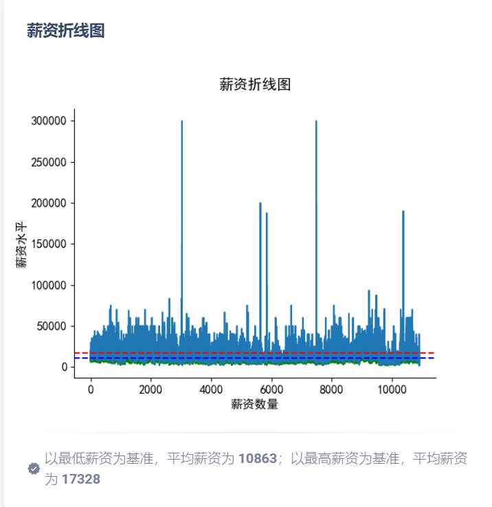

图5.11 薪资折线图

薪资折线图如图5.11所示，通过对薪资的分析，然后以最低薪资为基础判断数据，可以得知平均薪资为10863，最高薪资为基准平均薪资为17328，说明市场整体薪资较为充足，关键代码如下所示，展示了最低薪资和最高薪资随时间的变化趋势。首先，代码计算了最低薪资和最高薪资的平均值，并根据最高薪资计算了薪资水平的区间。然后，绘制了薪资折线图，横轴为薪资数量，纵轴为薪资水平，标题为“薪资折线图”。

<table>
<tr><td>&#x27;plot&#x27;: {  &#x27;title&#x27;: &#x27;薪资折线图&#x27;,  &#x27;data&#x27;: {  &#x27;minSalary&#x27;: minSalary.tolist(),  &#x27;maxSalary&#x27;: maxSalary.tolist()  },  &#x27;xlabel&#x27;: &#x27;薪资数量&#x27;,  &#x27;ylabel&#x27;: &#x27;薪资水平&#x27;,  &#x27;issue&#x27;: f&#x27;以最低薪资为基准，平均薪资为 &lt;b&gt;{avgMinSalary}&lt;/b&gt;；以最高薪资为基准，平均薪资为 &lt;b&gt;{avgMaxSalary}&lt;/b&gt;&#x27; }, avgMinSalary = int(sum(minSalary) / len(minSalary)) avgMaxSalary = int(sum(maxSalary) / len(maxSalary)) salaryLevel = str(int(max(salary) / 6)) salaryLevel = salaryLevel[0] + (len(salaryLevel) - 1) * &#x27;0&#x27; chart = items[&#x27;plot&#x27;] chartdata = chart[&#x27;data&#x27;] plt = drawer.plot(chartdata[&#x27;minSalary&#x27;], chartdata[&#x27;maxSalary&#x27;], list(range(len(chartdata[&#x27;minSalary&#x27;]))),  chart[&#x27;title&#x27;], chart[&#x27;xlabel&#x27;], chart[&#x27;ylabel&#x27;]) items[&#x27;plot&#x27;][&#x27;data&#x27;] = drawer.generate_base64(plt)</td></tr>
</table>

代码5.11 薪资折线图

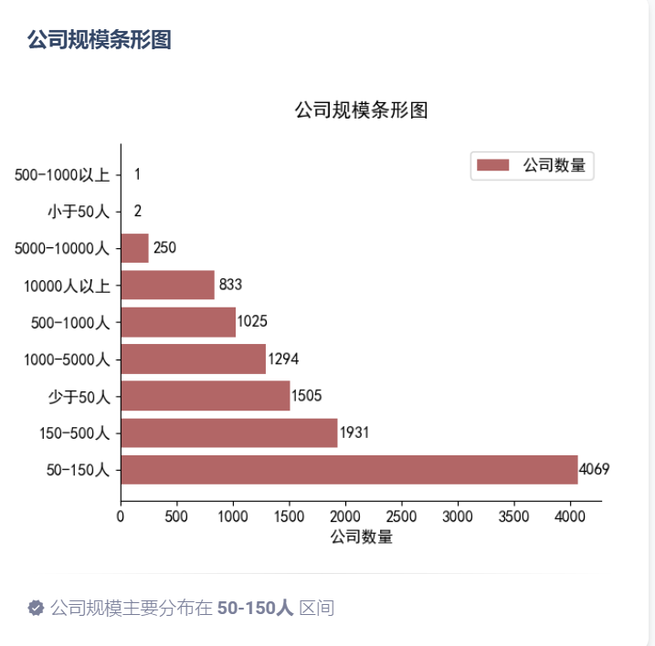

图5.12 公司规模

公司规模如图5.12所示，如图可以看出市场大部分公司人数为50-150人，以小公司居多，说明市场活力尚可，关键代码如下所示，首先从图表数据中提取了键和值，然后使用绘图工具绘制了水平条形图（横向柱状图）。图表的标题为“薪资分布水平条形图”，横轴标签为“薪资数量”，纵轴标签为“薪资水平”，图例标签为“薪资类型”。最后，将绘制的图表转换为 Base64 编码以便在页面中显示。

<table>
<tr><td>chartdata = chart[&#x27;data&#x27;] keys = list(chartdata.keys()) values = list(chartdata.values()) plt = drawer.barh(keys, values, chart[&#x27;title&#x27;], chart[&#x27;xlabel&#x27;], chart[&#x27;ylabel&#x27;], chart[&#x27;legendlabels&#x27;]) items[&#x27;barh&#x27;][&#x27;data&#x27;] = drawer.generate_base64(plt) def generate_base64(self, plt: matplotlib.pylab):  &quot;&quot;&quot; Generate base64 by plt   :Arg:  - plt: matplotlib.pylab  &quot;&quot;&quot;  buffer = BytesIO()  plt.savefig(buffer, format=&#x27;png&#x27;)  buffer.seek(0)  prefix = &#x27;data:image/png;base64,&#x27;  encoded = prefix + base64.b64encode(buffer.getvalue()).decode()  self.__close()  return encoded</td></tr>
</table>

代码5.12 公司规模

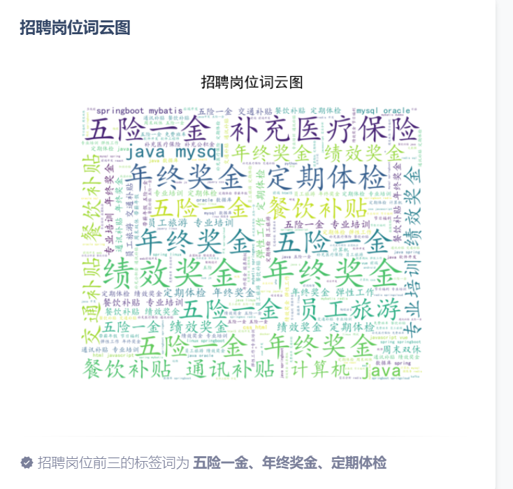

图5.13 词云图

词云图分析结果如图5.13所示，大部分关键词为五险一金，年终奖金，定期体检，说明求职者主要关系公司的福利而不是薪酬，说明大部分求职者都有长远的未来规划，关键代码如下所示，函数接受文本数据和标题作为参数，使用 WordCloud 库生成词云图。词云图的高度和宽度分别设置为 800 和 1000，背景颜色为白色。生成的词云图会被插入到当前的 matplotlib 图形中，然后设置标题，并关闭坐标轴。最后返回生成的 matplotlib 图形。

<table>
<tr><td>&quot;&quot;&quot; Draw barh wordcloud :Arg: - text: - title: plt title &quot;&quot;&quot; wordcloud = WordCloud(font_path=&#x27;/fonts/simkai.ttf&#x27;, height=800, width=1000, background_color=&quot;white&quot;).generate(text) self.plt.imshow(wordcloud, interpolation=&#x27;bilinear&#x27;) self.plt.title(title, y=1.05) self.plt.axis(&#x27;off&#x27;) return self.plt</td></tr>
</table>

代码5.13 词云图

## 系统测试

### 测试环境与方法

本系统拟采用黑盒测试的方法，通过测试来检测每个功能是否都能正常使用。在测试中，把程序看作一个不能打开的黑盒子，在完全不考虑程序内部结构和内部特性的情况下，在程序接口进行测试，它只检查程序功能是否按照需求规格说明书的规定正常使用，程序是否能适当地接收输入数据而产生正确的输出信息。

系统在开发环境下进行测试：

操作系统：Windows11；

开发语言版本：Python3.11；

编译器：Pycharm。

### 测试用例

系统登录测试，主要测试系统服务端是否正常对密码进行签名，是否可以正常拦截错误的账号与密码，登录成功UI是否自动跳转界面到首页，且服务端是否生成Session，然后UI其他页面是否判断了当前操作用户是否进行了登录，测试用例如表6.1所示。

表6.1 登录测试用例表

<table>
<tr><td>名称</td><td colspan="3">登录测试用例</td></tr>
<tr><td>概述</td><td colspan="3">测试账号与密码验证逻辑是否与设计一致 测试登录成功，接口是否返回了Session，UI是否跳转也页面 未登录的用户进入首页UI是否进行了限制，接口是否进行了限制 系统提前存入用户：admin，123456</td></tr>
<tr><td>步骤</td><td>步骤</td><td colspan="2">步骤与预期结果</td></tr>
<tr><td></td><td>1</td><td colspan="2">未登录的用户，浏览器输入系统首页</td></tr>
<tr><td></td><td>2</td><td colspan="2">登录界面输入账号admin，密码12345</td></tr>
<tr><td></td><td>3</td><td colspan="2">登录界面输入账号admin，密码123456</td></tr>
<tr><td colspan="4">测试结果</td></tr>
<tr><td>结果</td><td>1a</td><td>用户未登录，UI跳转登录界面，接口被拦截</td><td>通过</td></tr>
<tr><td></td><td>2a</td><td>登录界面提示账号与密码错误</td><td>通过</td></tr>
<tr><td></td><td>3a</td><td>提示登录成功，UI跳转首页，接口返回了生成的Session</td><td>通过</td></tr>
</table>

系统注册测试，主要测试系统是否对账号进行了重复性判断，如表6.2所示。

表6.2 注册测试用例

<table>
<tr><td>名称</td><td colspan="3">注册测试用例</td></tr>
<tr><td>概述</td><td colspan="3">进行系统注册，测试系统是否对账号进行了唯一性判断</td></tr>
<tr><td>步骤</td><td>步骤</td><td colspan="2">步骤与预期结果</td></tr>
<tr><td></td><td>1</td><td colspan="2">进入系统注册界面</td></tr>
<tr><td></td><td>2</td><td colspan="2">什么都不输入点击注册</td></tr>
<tr><td></td><td>3</td><td colspan="2">输入账号admin（重复），密码1234556</td></tr>
<tr><td></td><td>4</td><td colspan="2">输入账号admin（不重复），密码1234556</td></tr>
<tr><td colspan="4">测试结果</td></tr>
<tr><td>结果</td><td>1a</td><td>进入界面成功</td><td>通过</td></tr>
<tr><td></td><td>2a</td><td>注册失败，提示请输入基本信息</td><td>通过</td></tr>
<tr><td></td><td>3a</td><td>注册失败，账号重复</td><td>通过</td></tr>
<tr><td></td><td>4a</td><td>注册成功</td><td>通过</td></tr>
</table>

数据爬取测试用例中，主要测试爬取数据预览，导出，导入，数据爬取，数据清洗功能是否正常，测试结果如表6.3所示。

表6.3 数据爬取测试

<table>
<tr><td>名称</td><td colspan="3">数据爬取测试</td></tr>
<tr><td>概述</td><td colspan="3">测试爬取数据预览，导出，导入，数据爬取，数据清洗功能是否正常</td></tr>
<tr><td>步骤</td><td>步骤</td><td colspan="2">步骤与预期结果</td></tr>
<tr><td></td><td>1</td><td colspan="2">进入数据爬取预览界面</td></tr>
<tr><td></td><td>2</td><td colspan="2">点击导出</td></tr>
<tr><td></td><td>3</td><td colspan="2">点击导入，无数据</td></tr>
<tr><td></td><td>4</td><td colspan="2">点击导入，有数据</td></tr>
<tr><td></td><td>5</td><td colspan="2">点击数据爬取按钮</td></tr>
<tr><td></td><td>6</td><td colspan="2">进行数据清洗</td></tr>
<tr><td></td><td>7</td><td colspan="2">查看清洗预览界面</td></tr>
<tr><td colspan="4">测试结果</td></tr>
<tr><td>结果</td><td>1a</td><td>进入成功，有数据出现</td><td>通过</td></tr>
<tr><td></td><td>2a</td><td>导出成功</td><td>通过</td></tr>
<tr><td></td><td>3a</td><td>导入失败，无数据</td><td>通过</td></tr>
<tr><td></td><td>4a</td><td>导入成功</td><td>通过</td></tr>
<tr><td></td><td>5a</td><td>数据爬取成功</td><td>通过</td></tr>
<tr><td></td><td>6a</td><td>数据清洗成功，正确的展示了原数据，清洗的数据，清洗后的数据</td><td>通过</td></tr>
<tr><td></td><td>7a</td><td>清洗界面数据展示成功</td><td>通过</td></tr>
</table>

数据分析测试用例如表6.4所示，主要测试有数据情况下是否可以正常进行分析，无数据情况下进行分析是否会拦截，分析的结果是否可以正常展示在界面上。

表6.4 数据分析用例

<table>
<tr><td>名称</td><td colspan="3">数据分析</td></tr>
<tr><td>概述</td><td colspan="3">测试数据分析功能是否正常</td></tr>
<tr><td>步骤</td><td>步骤</td><td colspan="2">步骤与预期结果</td></tr>
<tr><td></td><td>1</td><td colspan="2">进入数据分析界面</td></tr>
<tr><td></td><td>2</td><td colspan="2">没有数据进行分析</td></tr>
<tr><td></td><td>3</td><td colspan="2">有数据进行分析</td></tr>
<tr><td></td><td>4</td><td colspan="2">查看分析结果</td></tr>
<tr><td colspan="4">测试结果</td></tr>
<tr><td>结果</td><td>1a</td><td>进入成功</td><td>通过</td></tr>
<tr><td></td><td>2a</td><td>分析失败</td><td>通过</td></tr>
<tr><td></td><td>3a</td><td>分析成功</td><td>通过</td></tr>
<tr><td></td><td>4a</td><td>分析结果查看成功，有各种图形</td><td>通过</td></tr>
</table>

## 结论

在这个招聘数据可视化系统的开发过程中，我们成功地实现了数据的清洗、分析和可视化展示，为用户提供了一个直观、全面的招聘数据分析平台。

我们通过爬取数据源的方式获取了大量的招聘信息，包括职位描述、薪资待遇、公司规模等关键信息。然后，我们对这些数据进行了清洗和预处理，去除了重复项、缺失值和异常数据，确保了数据的质量和准确性。

我们利用数据分析技术对清洗后的数据进行了深入挖掘和分析，包括工作年限的分布、学历要求的统计、薪资水平的对比等。通过对数据的统计和分析，我们可以发现招聘市场的趋势和规律，为求职者和招聘方提供决策支持和参考。

我们采用了多种可视化图表，如柱状图、饼状图、箱线图、散点图等，将数据直观地展现出来，使用户可以通过图表直观地了解数据的分布和变化趋势。这些可视化图表不仅美观直观，而且具有交互性和可定制性，用户可以根据自己的需求进行数据筛选和比较。

这个招聘数据可视化系统为用户提供了一个全面、直观的招聘数据分析平台，为求职者和招聘方提供了有价值的信息和参考，帮助他们更好地理解和应对招聘市场的变化。同时，也为我们今后进一步完善和优化系统提供了宝贵的经验和启示。我们将继续努力，不断改进和完善这个系统，为用户提供更好的服务和体验。
